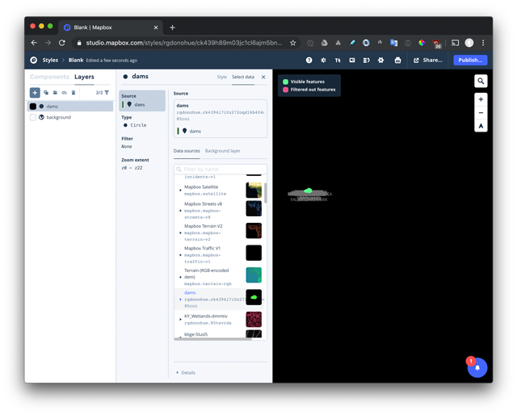

# Big data stories with Mapbox Studio and Storymap

In this short demonstration we're going to explore to aspects of mapping that are sometimes at odds: "big data" and story telling.

The theme for this presentation is water in Kentucky. * Note that this project is more for proof of concept and demonstration purposes, rather than the result of more purposeful data analysis and mapping.

## Getting started with the Mapbox vector tile ecosystem

Before we get into the ~~painful~~ fun details of how it all works, let's introduce some key concepts. You'll need to understand the following terms and definitions as they relate to Mapbox's products and services (drawn from [Mapbox's documentation](https://www.mapbox.com/help/studio-manual/))):

* **dataset**: An editable collection of GeoJSON features. Datasets are used to create vector tilesets.
* **vector tileset**: Vector data (i.e., a GeoJSON dataset) broken into a uniform grid of square tiles at 22 preset zoom levels. Unlike raster tiles which comprise pixels, vector tiles store data as points, lines, and polygons which can be dynamically manipulated, queried, and styled.
* map **style**: A textual document written as a JSON object that defines the visual appearance of a tileset.

We'll be working with all three of these within this lesson.

First, create a free [Mapbox account](https://www.mapbox.com/) if you haven't already (you likely did in Module 04/5 of MAP673). The Mapbox account will also give you access to [Mapbox Studio](https://www.mapbox.com/mapbox-studio/), which we'll be using within this lesson. You'll want to have your [Mapbox public access token](https://www.mapbox.com/help/define-access-token/) handy as well.

## data -> tileset -> style: the Mapbox Studio workflow

The following will guide us through:

1. a simple process of getting data in the right format, 
2. uploading to Mapbox Studio,
3. converting the GeoJSON to a tileset
4. adding that tileset to a Mapbox style 

### get the data and transform it to GeoJSON

We need some data to play with. Let's start with a dataset of dams from  Geospatial at the Bureau of Transportation Statistics.

Navigate to this page and download the data as a Shapefile: http://osav-usdot.opendata.arcgis.com/datasets/3e63fd98063f4a7fa1713bb62b0abe01_0


We can open this file in QGIS to explore the data a bit. We could bring it into a Jupyter Notebook as well.

For now we'll simply use the Mapshaper Cli to get a better sense of the data.

Unzip the file and navigate your terminal within the directory containing the Shapefiles.

```bash
$ cd Dams
mapshaper Dams.shp -info
```

This tells us some valuable information for our process here. Namely that the data are already in WGS84 (required for uploading GeoJSON to Mapbox Studio as a dataset). We also know the number of records (8,121 dam features), as well as a list of the data attributes.

We can see that there is a `State` field and the first value is 'PR', so it appears the data field uses the two character state abbreviation.

Mapbox Studio allows us to upload raw data but wants it in a GeoJSON, JSON, or CSV format.

We can quickly convert this Shapefile into GeoJSON with Mapshaper, as well as 1.) filter for the features only contained within Kentucky, 2.) select the data attributes we wish to retain, and 3.) trim the precision of the output coordinates to 5 decimal places ... all with a single command:

```bash
mapshaper Dams.shp -filter '"KY".indexOf(STATE) > -1' -filter-fields CITY,COUNTY,DAM_NAME,MAX_STOR,RIVER -o precision=.00001 format=geojson dams.json
```

Now we have a very small GeoJSON (44kb) with 209 of the 8,121 original dam features.

### upload GeoJSON data to Mapbox Studio and export as a tileset

Flip to Mapbox Studio with the browser, choose **Datasets** -> **Upload** and hit confirm to upload the dams.json.

  

Now that it's uploaded, Mapbox studio gives you a chance to edit the data. We're going to skip this step and **Export** it to a new tileset.

 
This is a computationally heavy process (converting GeoJSON to mbtiles) so studio will crank along for a while on this.

When complete, we now have a tileset named damns.


## create a new style and add dams tileset as a data source

Next, switch to the Styles (beta) page and create a **New style**. Here you're given the option of choosing an existing style template to work with. We're going to be masochists and start with a Blank template.


Choose **Customize Blank**.

Next, add the newly created dams.json as a new layer.



We can add a background color (perhaps something dark), as well as change the color of our dots. We can even scale the size of the circles based on our data attribute MAX_STOR, using a linear function with a min circle radius of 3 px and a max of 15px.


When we're ready to [share a draft preview]( https://api.mapbox.com/styles/v1/rgdonohue/ck439h89m03jc1cl6ajm5bnr5.html?fresh=true&title=view&access_token=pk.eyJ1Ijoicmdkb25vaHVlIiwiYSI6Im5Ua3F4UzgifQ.PClcVzU5OUj17kuxqsY_Dg#6.0/37.683203/-85.402481/0) or use our style in a map, we can select **Publish**. You can share a URL for a preview, as well as make it public to share more openly.

From here you can load the style into a webpage, such as by using this example: [Display a map with a custom style](https://docs.mapbox.com/mapbox-gl-js/example/custom-style-id/).

But we're going to add a second dataset to our mapping project first.

## getting big data into Mapbox Studio.

Let's now say we want to include some additional data of water in Kentucky to our style.

We're going to pull data from the US Fish & Wildlife service:  https://www.fws.gov/wetlands/Data/Data-Download.html

Navigate to State Downloads and download the Shapefile for Kentucky's data: https://www.fws.gov/wetlands/Data/State-Downloads.html

This is a large 347 MB zipped Shapefile. Unzip it and practice our process we used above.

We're interested in the KY_Wetlands.shp set. First let's learn something about the dataset.

From the terminal:

```bash
$ cd ../KY_shapefile_wetlands
$ mapshaper KY_Wetlands.shp -info
```

We see that the data is projected and contains 430,314 features.

Let's try converting it to GeoJSON. Recall we want the data in WGS84 unprojected coordinates. We'll simply retain one field of possible interest here for later styling.

```bash
$ mapshaper KY_Wetlands.shp -proj wgs84 -filter-fields WETLAND_TY -o precision=.00001 format=geojson ky_wetlands.json
```

This will take some time to crank. The result will be a very large (675 MB) GeoJSON. This file is too large to conveniently upload through the Mapbox Studio web interface.

Instead, we can convert this GeoJSON file locally to the format that supports the Mapbox tilesets, mbtiles. To do this we need to have [Tippecanoe](https://github.com/mapbox/tippecanoe) installed on our system.

From the terminal, I can then make the conversion, specifying some preferred zoom levels for the tiles (6 - 12 for this demo).

```bash
$ tippecanoe -z 12 -Z 6 -o ky_wetlands.mbtiles --drop-densest-as-needed ky_wetlands.json
```

Tippecanoe will crank for a while and if successful, produce a reasonably sized (69.1 MB) .mbtiles file ready for uploading to Mapbox Studio.

We can then upload this file directly as a **New Tileset** (note a Dataset).


We can now switch back to our KY Watersheds style and add this second tileset as a new layer. Style it, and republish the style.

Again, you can share the style as a preview, or use it as a developer in a web map. We'll now turn to the latter process.

## Creating a story map with a Mapbox storytelling template

We'll now do a hands on demonstration of getting our style loaded into a web page and begin to customize a sequence of "chapters" with which we can tell a spatial story about our mapped data. 


