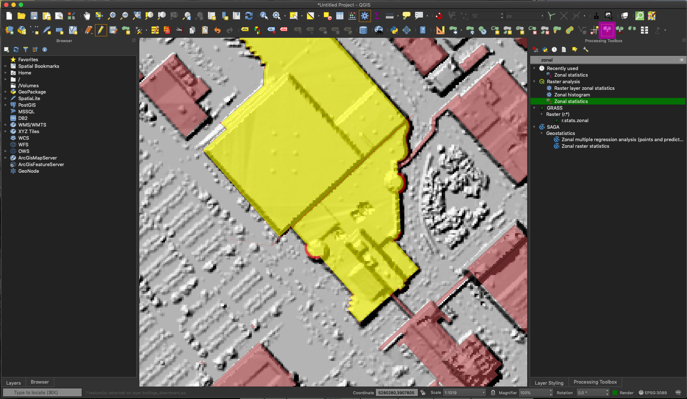

# Adding buildings and textures in Mapbox Studio 
A collection of unique things that Mapbox can do

## Location and time

[Map to Miller Hall](https://maptimelex.github.io/location/) | [Presentation](#) | Thursday, December 12, 6 PM Lexington, KY

<!-- TOC -->

- [Mapbox does that?](#mapbox-does-that)
    - [Location and time](#location-and-time)
    - [TL;DR](#tldr)
    - [Data](#data)
    - [Steps in QGIS](#steps-in-qgis)
    - [Steps in Mapbox](#steps-in-mapbox)

<!-- /TOC -->

## TL;DR

Mapbox Studio has added extruded building polygons as of December 12. Let's make them anyway and see if we can do better?

## Data

Find the raster DEM and DSM for downtown Lexington and Shapefile of buildings with height attributes here: [outrageGIS.com/pointclouds/data/lex_building_heights_from_lidar.zip](https://outrageGIS.com/pointclouds/data/lex_building_heights_from_lidar.zip) (336 MB)

## Steps in QGIS

We need to add height information to building polygons. Unzip the data and add the digital elevation model, digital surface model, and building polygons.

## Steps in Mapbox

